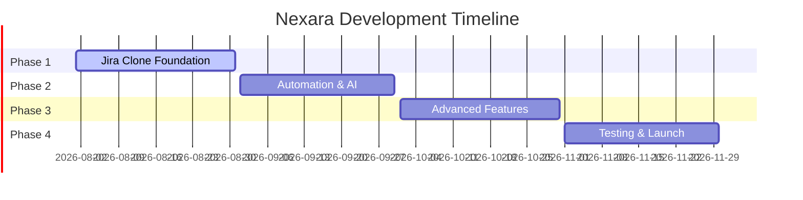

[](https://postimg.cc/8JfzMb84)
<div align="center">

# AI-Powered Project Management Platform

</div>

<p align="center">
  <picture>
    <source media="(prefers-color-scheme: dark)" srcset="public/assets/logos/logo-icon-for-dark-bg.svg" />
    <source media="(prefers-color-scheme: light)" srcset="public/assets/logos/logo-icon-for-light-bg.svg" />
    
  </picture>
</p>

<div align="center">

[](LICENSE)
[](https://join.slack.com/t/promptzy/shared_invite/zt-3acy22kkh-R~nMYTl7op_MF5UaLnwdsA)
[](https://www.typescriptlang.org/)
[](https://nextjs.org/)
[](#-automated-contribution-system)

_Intelligent automation and AI-driven insights for modern development teams_

</div>

---

## 🤖 Automated Contribution System

**Welcome Contributors!** This repository features a comprehensive automation system that makes contributing effortless:

### ✨ **What Happens Automatically:**

- 🏷️ **Smart Labeling** - PRs get labeled by type, area, size, and priority
- 👍 **Auto-Approval** - External PRs are automatically approved to run workflows
- 🎯 **Quality Checks** - Automatic linting, testing, and build verification
- 📊 **Contributor Tracking** - All contributions are tracked and rewarded
- 🔄 **Workflow Execution** - All workflows run for all contributors immediately

### 🎮 **Manual Commands Available:**

- `/check` - Re-run all quality checks and workflows
- `/rerun` - Re-run failed workflows and refresh approvals
- `/label` - Re-trigger smart labeling system
- Plus [15+ other commands](#available-commands) for advanced management

### 📈 **For New Contributors:**

1. **Fork the repository** and create your branch
2. **Make your changes** - the system auto-detects the type and scope
3. **Open a pull request** - automation kicks in immediately:
   - ✅ PR gets automatically approved for workflow execution
   - 🏷️ Smart labels applied (type/feature, area/frontend, size/M, etc.)
   - 🧪 All quality checks run automatically (no waiting!)
   - 📝 You're added to our contributor tracking system
4. **Address any feedback** - use `/check` to re-run tests after fixes
5. **Get merged** - maintainers can use `/merge` for quick integration

### 🛠️ **Zero Configuration Required:**

- **No setup needed** - automation works out of the box
- **All PR types welcome** - features, fixes, docs, tests, refactors
- **External forks supported** - same experience for everyone
- **Graceful error handling** - clear feedback if something goes wrong

---

## 🤖 GitHub Bot Commands

This repository includes a powerful GitHub bot that responds to slash commands in issues and pull requests:

### Available Commands:

- `/assign @username` - Assigns an issue or PR to the mentioned user
- `/unassign @username` - Unassigns the mentioned user from an issue or PR
- `/merge` - Merges a pull request and closes linked issues (restricted to authorized users)
- `/approve [message]` - Approves a pull request with optional auto-merge
- `/lgtm [message]` - Approves a pull request with "Looks Good To Me"
- `/rerun` - Re-runs all failed workflows and approves waiting workflows for a PR
- `/check` - Runs all workflows and checks for a PR (perfect for new contributors)
- `/review @username` - Requests a review from the mentioned user
- `/status` - Checks the status of a pull request and provides merge readiness assessment
- `/bug` - Adds the "type: bug" label to the issue or PR
- `/feature` - Adds the "type: feature" label to the issue or PR

### How to Use:

1. **In any issue or pull request**, post a comment with one of the slash commands above
2. **The bot will react** with an emoji to show it received the command
3. **The command will execute** and the bot will post a confirmation message
4. **Check the Actions tab** if a command doesn't work as expected

### Automated Features:

- **Pull requests are automatically labeled** based on changed files
- **Size labels** (XS, S, M, L, XL) are added based on the number of lines changed
- **Component labels** help identify which part of the codebase is affected
- **Technology labels** help identify the languages and frameworks involved
- **Linked issues are automatically closed** when PRs are merged via bot commands
- **Workflows run automatically** for all contributors without waiting for approval
- **First-time contributors** can use `/check` command to run all workflows manually
- **Manual override** available with `/rerun` and `/check` commands for any PR

### Workflow Automation:

- **All contributors** get automatic workflow approval and execution
- **Documentation changes** (.md, docs/, README files) run automatically
- **All PR types** get automatic approval - welcoming to new contributors
- **Manual override** available with `/rerun` and `/check` commands for any PR
- **Zero-config setup** - works out of the box for all contributions

### Issue Linking:

When using `/merge` or `/approve` commands, the bot automatically:

- Searches PR title, body, and commit messages for issue references
- Closes linked issues using patterns like "Closes #123", "Fixes #456", "Resolves #789"
- Posts a confirmation comment on both the PR and closed issues

### Security:

- The `/merge` command is restricted to authorized users only
- All workflow changes require approval from repository maintainers
- Commands provide clear feedback on success or failure

### Status: ✅ **ACTIVE** - Bot is configured and ready to use!

---

## 🚀 Project Overview

Zenjira is like a personal AI assistant for Jira teams. It helps save time and reduce manual work by offering:

- **No-code automation** using n8n (just drag and drop rules!)
- **AI features** like ticket summarization and sprint planning with GPT‑4
- **Live dashboards** and visual tools like Gantt charts
- **Deep integrations** with GitHub/GitLab, Slack, CI/CD tools, and more

It’s built as a full **web application** — not just a browser extension — meaning teams log into Zenjira just like any other SaaS platform to get started.

---

## ✨ Features

### Core Features

- **Automation Designer**: Use n8n's drag-and-drop editor to automate Jira events like task transitions or sending Slack notifications.
- **AI Sprint Planner**: GPT‑4 helps generate sprints based on team capacity and priorities.
- **Smart Ticket Summaries**: Instantly summarize long issue descriptions with AI.
- **ChatOps Bot**: Use Slack or Microsoft Teams to ask things like "What are today's blockers?"
- **Developer Load Balancer**: Distribute tasks more evenly to avoid burnout.

### Advanced Features

- **Semantic Search**: Use Hugging Face models to search Jira issues based on meaning, not just keywords.
- **AI Test Case Generator**: Turn bug reports into suggested test cases.
- **Retrospective Insights**: Get reports on what worked and what didn’t after every sprint.
- **Gantt and Calendar Views**: Visual tools to see due dates, timelines, and sprint plans.
- **Cross-Project Heatmap**: Identify bottlenecks and dependencies between multiple projects.
- **Auto Release Notes**: Generate release notes from closed issues and merged pull requests.

---

## 🛠 Technology Stack

<details>
<summary><strong>Frontend Architecture</strong></summary>

| Technology        | Purpose           | Version |
| ----------------- | ----------------- | ------- |
| **Next.js**       | React Framework   | 13+     |
| **TypeScript**    | Type Safety       | 4.9+    |
| **Tailwind CSS**  | Styling System    | 3.x     |
| **shadcn/ui**     | Component Library | Latest  |
| **Redux Toolkit** | State Management  | 1.9+    |

</details>

<details>
<summary><strong>Backend Infrastructure</strong></summary>

| Technology            | Purpose                 | Implementation   |
| --------------------- | ----------------------- | ---------------- |
| **Node.js + Express** | Runtime & API Framework | REST/GraphQL     |
| **PostgreSQL**        | Primary Database        | 14+              |
| **Redis**             | Caching & Sessions      | 7+               |
| **BullMQ**            | Job Queue System        | Latest           |
| **JWT + OAuth2**      | Authentication          | Jira Integration |

</details>

<details>
<summary><strong>AI & Machine Learning</strong></summary>

| Service          | Purpose                     | Provider     |
| ---------------- | --------------------------- | ------------ |
| **GPT-4**        | Natural Language Processing | OpenAI       |
| **LangChain**    | AI Pipeline Management      | Community    |
| **Hugging Face** | Semantic Search Models      | Transformers |

</details>

<details>
<summary><strong>DevOps & Infrastructure</strong></summary>

| Technology               | Purpose              | Environment |
| ------------------------ | -------------------- | ----------- |
| **PostgreSQL**           | Database             | All         |
| **Kubernetes**           | Orchestration        | Production  |
| **GitHub Actions**       | CI/CD Pipeline       | All         |
| **AWS EKS**              | Managed Kubernetes   | Production  |
| **Prometheus + Grafana** | Monitoring & Metrics | Production  |

</details>

---

## 💬 Community & Support

<div align="center">

### Join Our Developer Community

[](https://join.slack.com/t/promptzy/shared_invite/zt-3acy22kkh-R~nMYTl7op_MF5UaLnwdsA)

Connect with fellow developers, get technical support, and stay updated on the latest features and releases.

</div>

---

## � Development Roadmap

<div align="center">

### 4-Month Sprint to Production

</div>



### 🗓 **Phase 1: Jira Clone Foundation** _(Month 1)_

- [ ] **Core Jira Clone** - Build basic project management features (issues, boards, sprints)
- [ ] **User Management** - Authentication, user roles, and permissions
- [ ] **Issue Management** - Create, edit, assign, and track issues with status workflows
- [ ] **Project Boards** - Kanban boards and basic sprint functionality
- [ ] **Infrastructure Setup** - PostgreSQL, Redis, and development environment

### 🔧 **Phase 2: Automation & Intelligence** _(Month 2)_

- [ ] **Automation Engine** - n8n integration and workflow builder for custom automations
- [ ] **External Jira Integration** - OAuth2 connection to existing Jira instances for migration/sync
- [ ] **AI Features** - GPT-4 integration for intelligent summaries and planning assistance
- [ ] **ChatOps Bot** - Slack/Teams integration for team communication and notifications

### 🤖 **Phase 3: Advanced Features** _(Month 3)_

- [ ] **Semantic Search** - Hugging Face model integration for intelligent issue discovery
- [ ] **VCS Integration** - GitHub/GitLab pull request insights and code-to-issue linking
- [ ] **Advanced Analytics** - Sprint retrospectives and team performance metrics
- [ ] **Visual Dashboards** - Gantt charts, burndown charts, and cross-project heatmaps

### 🚀 **Phase 4: Production Ready** _(Month 4)_

- [ ] **Quality Assurance** - Comprehensive testing suite (Jest, Cypress)
- [ ] **Performance Optimization** - Load testing and optimization
- [ ] **Monitoring & Observability** - Prometheus, Sentry, logging
- [ ] **Documentation & Launch** - API docs, user guides, beta release

---

## 🚀 Quick Start

### Prerequisites

- **Node.js** 18+ and **npm** (or **yarn**)
- **Git** for version control

### Installation & Setup

1. **Clone the repository**

   ```bash
   git clone https://github.com/your-org/Nexara.git
   cd Nexara
   ```

2. **Install dependencies**

   ```bash
   # Install all dependencies (root, frontend, and backend)
   npm run install:all

   # Or install individually:
   # Frontend: cd frontend && npm install
   # Backend: cd backend && npm install
   ```

3. **Environment setup**
   ```bash
   # Copy environment file and configure
   cd backend
   cp .env.example .env
   # Edit .env with your configuration
   ```

### Development Commands

#### 🎨 **Frontend (Next.js)**

```bash
cd frontend

# Start development server with Turbopack
npm run dev        # Runs on http://localhost:3000

# Build for production
npm run build

# Start production server
npm run start

# Run linting
npm run lint
```

#### ⚙️ **Backend (Express API)**

```bash
cd backend

# Start development server with auto-reload
npm run dev        # Runs on http://localhost:5000

# Start production server
npm start

# Check API health
curl http://localhost:5000/health

# Format backend code
npm run format

# Check code formatting
npm run format:check
```

#### 🔄 **Full Stack Development**

```bash
# Option 1: Run both frontend and backend simultaneously (recommended)
npm run dev        # Runs both servers with auto-reload

# Option 2: Run individually in separate terminals
# Terminal 1: Start backend
npm run dev:backend

# Terminal 2: Start frontend
npm run dev:frontend
```

#### 🎨 **Code Formatting (Prettier)**

```bash
# Format backend code
npm run format:backend

# Check backend formatting
npm run format:check:backend

# Or from backend directory
cd backend
npm run format
npm run format:check
```

### API Endpoints

| Endpoint                    | Method | Description                              |
| --------------------------- | ------ | ---------------------------------------- |
| `/health`                   | GET    | Server health check                      |
| `/api/test`                 | GET    | API connectivity test                    |
| `/api/jira/projects`        | GET    | List Jira projects _(coming soon)_       |
| `/api/automation/workflows` | GET    | Automation workflows _(coming soon)_     |
| `/api/ai/summarize`         | POST   | AI-powered summarization _(coming soon)_ |

### Development URLs

- **Frontend**: http://localhost:3000
- **Backend API**: http://localhost:5000
- **API Health Check**: http://localhost:5000/health

---

## 📜 Code of Conduct

Please read our [Code of Conduct](./CODE_OF_CONDUCT.md) to understand the expected behavior in this community.

## Community Guidelines

📜 Please review our [Community Guidelines](./COMMUNITY_GUIDELINES.md) before contributing.

## 👥 Contributors

We welcome and appreciate all contributions! Our automated contribution tracking system rewards merged PRs based on difficulty:

> **Note:** The scoring system applies only to GSSOC contributors.

🟢 **Level 1** (4 points) - Bug fixes, documentation, minor improvements  
🟡 **Level 2** (7 points) - Features, refactoring, moderate complexity  
🔴 **Level 3** (10 points) - Complex features, architecture changes

See the current leaderboard and detailed contribution stats in [CONTRIBUTORS.md](./CONTRIBUTORS.md).

📚 Learn more about our contribution tracking system in [docs/CONTRIBUTION_TRACKING.md](./docs/CONTRIBUTION_TRACKING.md).

<div align="center">

### 🌟 Our Amazing Contributors

<a href="https://github.com/Promptzy/Zenjira/graphs/contributors">
  
</a>

_Can't see the contributors graph? [View all contributors on GitHub →](https://github.com/Promptzy/Zenjira/graphs/contributors)_

[](https://github.com/Promptzy/Zenjira/graphs/contributors)

</div>

## 📄 License

This project is licensed under the MIT License - see the [LICENSE](LICENSE) file for details.

---

<div align="center">

**Built with ❤️ by the Nexara Team**

_Transforming development workflows, one sprint at a time._

</div>
